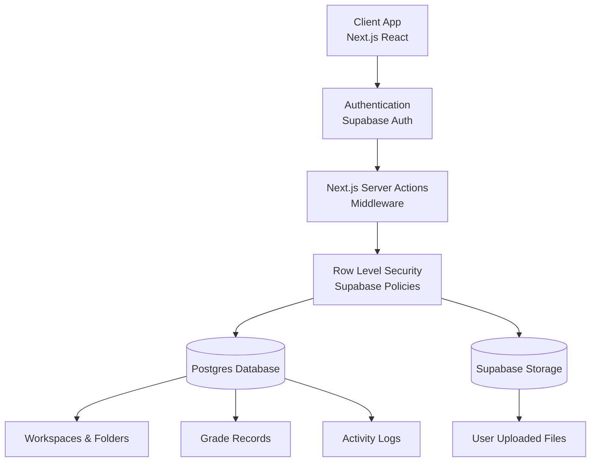

# AntiDrive Architecture

AntiDrive is a modern, full-stack, secure file management application built on Next.js 14+ and Supabase. The core architecture is designed to enforce strict multi-tenancy where each user is given a completely isolated workspace.

## System Architecture

The following diagram illustrates the flow of data and security checks from the client down to the database and storage layers.

## Core Workflows

### Authentication Flow
1. Users sign up or log in via the Supabase Auth client.
2. Next.js middleware intercepts requests to protected routes (`/dashboard`, `/settings`, etc.) and verifies the session token.
3. Upon first login, a database trigger automatically generates a `profile` and a default `workspace` for the user.

### File Management Flow
1. A user uploads a file through the drag-and-drop UI (`react-dropzone`).
2. The client requests a pre-signed URL or directly uploads to Supabase Storage.
3. **Storage Policies** intercept the upload. They verify that the `auth.uid()` matches the top-level directory of the upload path.
4. Once stored, a Server Action creates a corresponding metadata record in the `files` table.
5. **Row Level Security (RLS)** intercepts the insert, verifying that the `workspace_id` belongs to the current user.

### Analytics & Grade Flow
1. Users can securely attach an identifier (student code) to their profile.
2. Grade records are imported in bulk by an Admin via CSV.
3. The dashboard queries the `grades` table. RLS ensures that non-admins can only see grades explicitly linked to their verified student code.

## Technology Decisions

- **Why Next.js?** App Router provides excellent support for Server Actions, allowing us to perform secure database mutations without exposing a custom API layer. The integration of React Server Components (RSC) ensures fast initial load times.
- **Why Supabase?** Provides a unified Auth, Database, and Storage solution. Crucially, its Row Level Security (RLS) allows us to define security rules directly in Postgres, preventing unauthorized data access regardless of the client or server path.
- **Why Server Actions?** They replace traditional API routes, keeping mutation logic typed, strictly co-located with the UI, and executed securely on the server.
